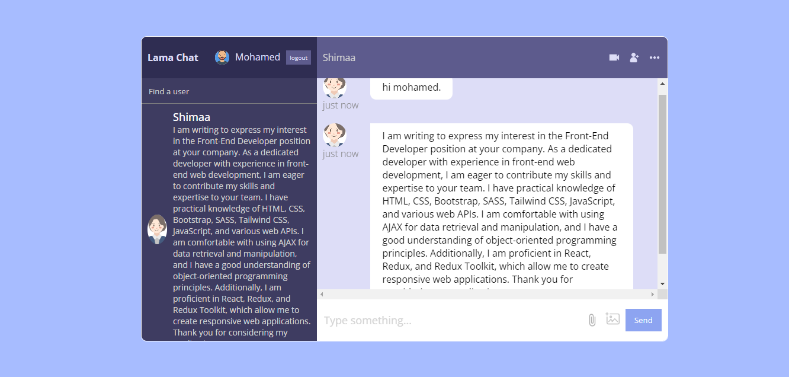

# Chat App

This is a simple chat application built with React, Context API, and Firebase. The app allows users to join chat rooms and exchange messages in real-time.

## Features

- **Real-time Messaging:** Messages are sent and received instantly using Firebase Firestore.
- **User Authentication:** Google sign-in is implemented using Firebase Authentication.
- **Context API:** React Context API is used for state management.

## Tech Stack

- **React:** JavaScript library for building user interfaces.
- **Firebase:** Cloud-based platform for web and mobile app development.
- **Context API:** State management solution for React applications.
- **SCSS:** A preprocessor scripting language that is interpreted or compiled into Cascading Style Sheets (CSS).

